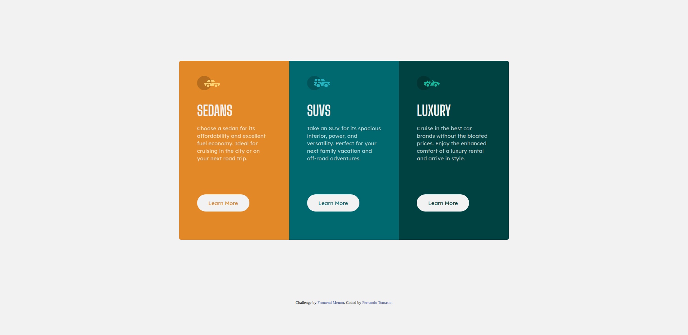

# Frontend Mentor - 3-column preview card component solution

This is a solution to the [3-column preview card component challenge on Frontend Mentor](https://www.frontendmentor.io/challenges/3column-preview-card-component-pH92eAR2-). Frontend Mentor challenges help you improve your coding skills by building realistic projects. 

## Table of contents

- [Overview](#overview)
  - [The challenge](#the-challenge)
  - [Screenshot](#screenshot)
  - [Links](#links)
- [My process](#my-process)
  - [Built with](#built-with)
  - [Continued development](#continued-development)
  - [Useful resources](#useful-resources)
- [Author](#author)

**Note: Delete this note and update the table of contents based on what sections you keep.**

## Overview

### The challenge

Users should be able to:

- View the optimal layout depending on their device's screen size
- See hover states for interactive elements

### Screenshot

### Links

- Solution URL: [solution URL here](https://your-solution-url.com)
- Live Site URL: [live site URL here](https://fernandotomasio.github.io/3-column-preview-card-component-challenge-on-Frontend-Mentor/)

## My process

### Built with

- HTML5 markup
- CSS
- Flexbox

### Continued development

Use this section to outline areas that you want to continue focusing on in future projects. These could be concepts you're still not completely comfortable with or techniques you found useful that you want to refine and perfect.

**Note: Delete this note and the content within this section and replace with your own plans for continued development.**

### Useful resources

- [Normalize.css](https://necolas.github.io/normalize.css/) - Normalize.css
- [Reset CSS](https://meyerweb.com/eric/tools/css/reset/) - Reset CSS

## Author

- Frontend Mentor - [@yourusername](https://www.frontendmentor.io/profile/fernandotomasio)
- Twitter - [@yourusername](https://twitter.com/fernandotomasio)
